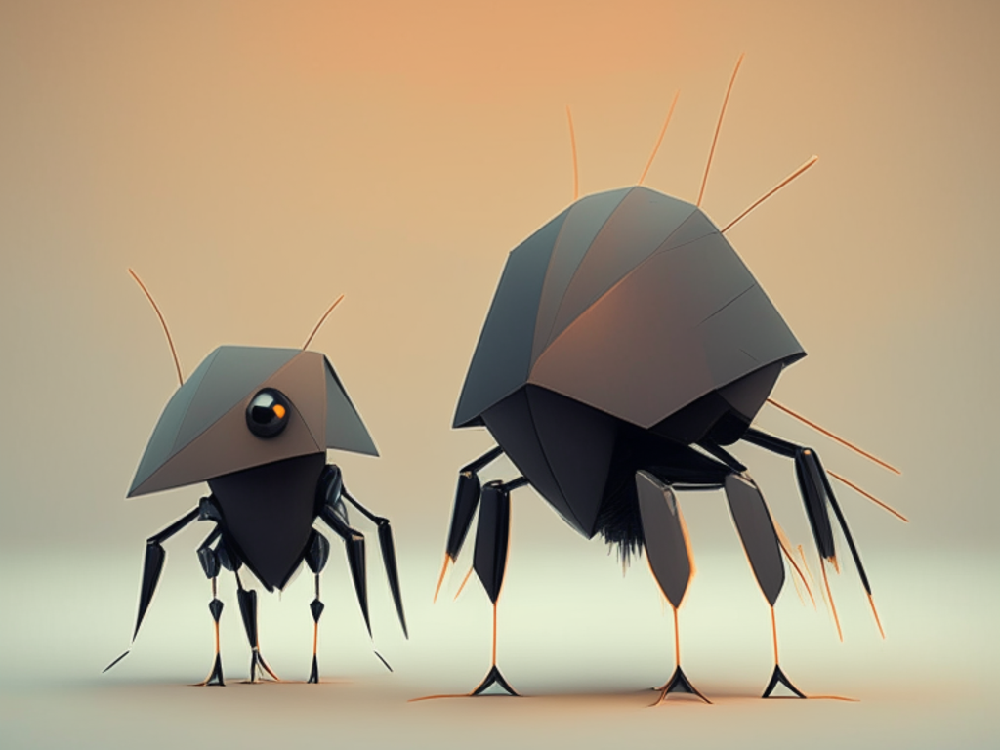

<!-- ⚠️ This README has been generated from the file(s) "blueprint.md" ⚠️--><h1 align="center">boid-chat</h1>

  

## ➤ Table of Contents

* [➤ ::pencil:: About The Project](#-pencil-about-the-project)
* [➤ :rocket: Dependencies](#-rocket-dependencies)
* [➤ :floppy_disk: Key Project File Description](#-floppy_disk-key-project-file-description)
	* [Front End](#front-end)
	* [Back End](#back-end)
* [➤ :coffee: Buy me a coffee](#-coffee-buy-me-a-coffee)
* [➤ :scroll: Credits](#-scroll-credits)
* [➤ License](#-license)

## ➤ ::pencil:: About The Project

Boid Chat is an innovative real-time web Chat Application that combines interactive 3D-rendered flock simulations with global connectivity.

By selecting a unique username and joining a chat room, users can seamlessly exchange messages with people from across the globe. Each virtual room is driven by 600 individual boids, each adhering to the fundamental principles outlined in the renowned [Boids](https://www.red3d.com/cwr/boids) paper by Craig Reynolds, first published in 1987.

Explore the dynamic world of Boid Chat and connect with users worldwide through this engaging platform!

## ➤ :rocket: Dependencies

Boid Chat utilizes several key packages and technologies to power its features:

  

  

   

  

## ➤ :floppy_disk: Key Project File Description

### Front End
* boids.tsx - Renders the boids
* boidAgent.ts - Handles boids logic
* joinPage.tsx - Page where users select a name and a room
* main.tsx - Client-side socket logic
* chatbox.tsx - Main chat box component
### Back End
* router.ts - Initiates the server-side server
* index.ts - Handles the real-time server with user  management logic
* users.ts - Several function to manage user data in chat app

## ➤ :coffee: Buy me a coffee
Whether you use this project, have learned something from it, or just like it, please consider supporting it by buying me a coffee, so I can dedicate more time on open-source projects like this :)

## ➤ :scroll: Credits

Theo Moore-Calters 

 

## ➤ License
	
Licensed under [MIT](https://opensource.org/license/mit-0/).
